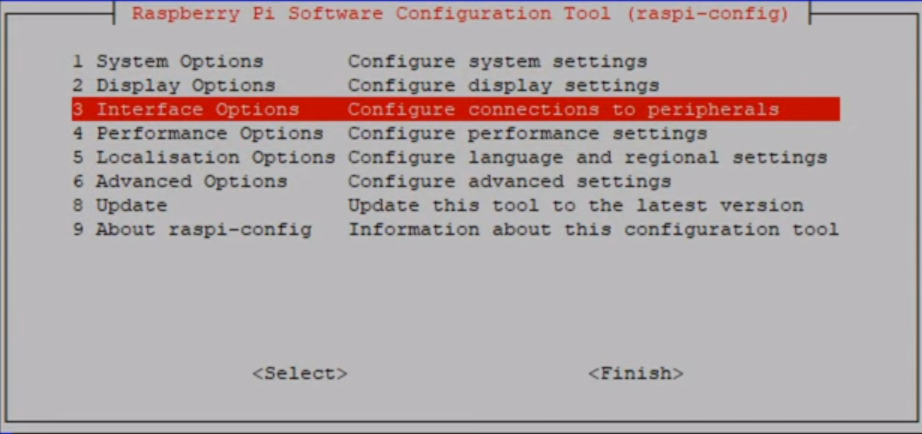
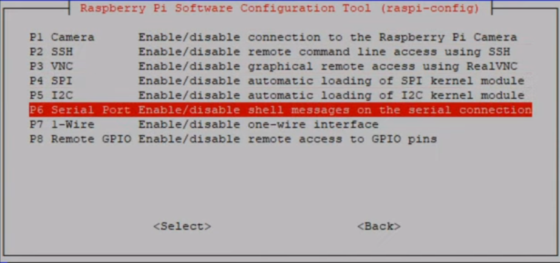
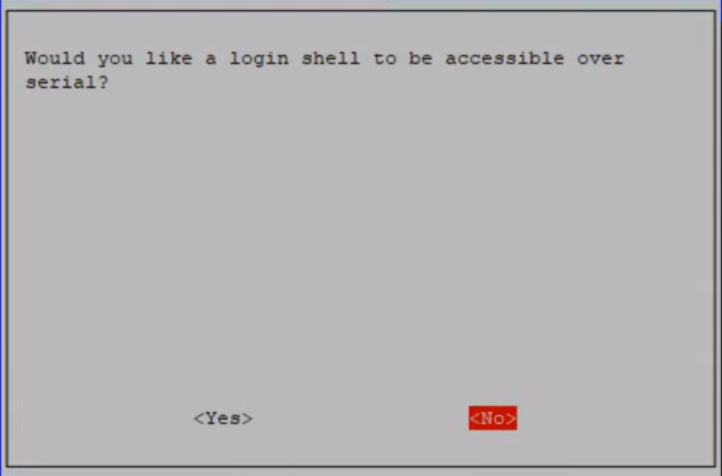
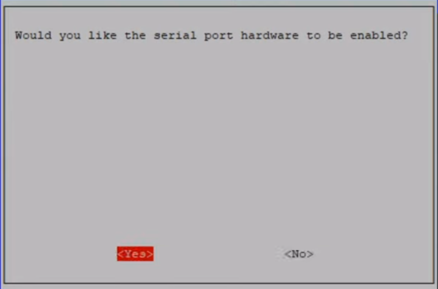
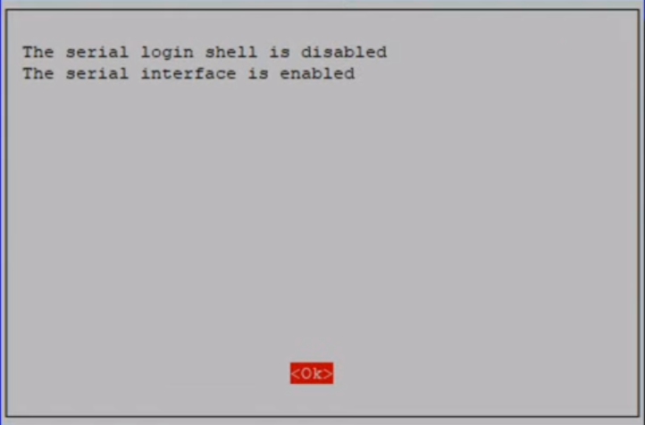

# Setup
Run the following commands in the terminal to setup the required Tools, Libraries, Modules and Software
```bash
sudo apt update
sudo apt-get update
sudp apt upgrade
sudo apt install python3-pip python3-dev python-dev-is-python3 screen python3-wxgtk4.0 python3-lxml
sudo apt install python3-future
sudo pip3 install pyserial MAVProxy colorama pymavlink --break-system-packages
```
# Configure UART Communication
Type the following command to open up the Raspberry Pi Configuration in Terminal
```bash
sudo raspi-config
```
* Then Select **3. Interface Options**<br />
<br />
* Then Select **P6 Serial Port**<br />
<br />
* Select **No** for **Login Shell to be accessible over serial**<br />
<br />
* Select **Yes** for **Serial Port Hardware to be enabled**<br />
<br />
* Click OK<br />
<br />
* Then Finish the Setup
## Disable Usage of UART by Bluetooth
In Raspberry Pi, the Bluetooth uses the UART. So to disable it, type the following command in the terminal
```bash
sudo echo 'dtoverlay=disable-bt' >> /boot/firmware/config.txt
```